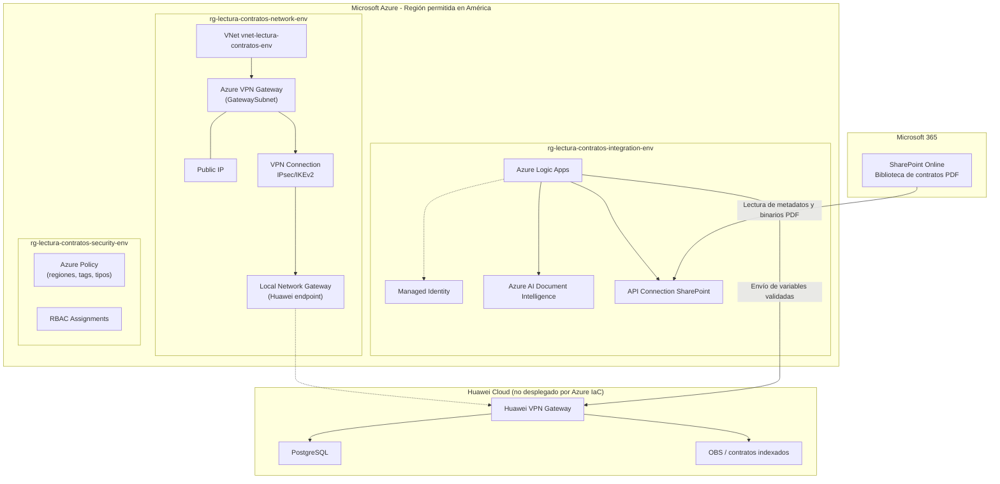

# Requerimientos del proyecto - Lectura Masiva de Contratos

## 1. Resumen del proyecto

El proyecto **Lectura Masiva de Contratos** tiene como objetivo implementar una solución en Microsoft Azure para procesar contratos PDF almacenados en **SharePoint Online**, extraer información mediante **Azure AI Document Intelligence**, orquestar el flujo con **Azure Logic Apps** y preparar el envío seguro de variables contractuales hacia una plataforma externa ubicada en Huawei Cloud mediante una conexión **VPN Site-to-Site IPsec/IKEv2**.

El alcance de despliegue de esta fase considera únicamente los componentes de la nube de **Microsoft Azure**. No se desplegarán recursos de Huawei Cloud ni componentes fuera del diagrama aprobado.

## Índice

1. [Resumen del proyecto](#1-resumen-del-proyecto)
2. [Alcance de la solución Azure](#2-alcance-de-la-solución-azure)
3. [Componentes Azure requeridos](#3-componentes-azure-requeridos)
4. [Componentes fuera de alcance](#4-componentes-fuera-de-alcance)
5. [Diagrama de despliegue](#5-diagrama-de-despliegue)
6. [Flujo funcional esperado](#6-flujo-funcional-esperado)
7. [Regiones permitidas](#7-regiones-permitidas)
8. [Requerimientos de red](#8-requerimientos-de-red)
9. [Requerimientos de Microsoft 365](#9-requerimientos-de-microsoft-365)
10. [Requerimientos de Azure Landing Zone](#10-requerimientos-de-azure-landing-zone)
11. [Niveles de permisos y roles](#11-niveles-de-permisos-y-roles)
12. [Parámetros requeridos para el despliegue](#12-parámetros-requeridos-para-el-despliegue)
13. [Validaciones previas al despliegue](#13-validaciones-previas-al-despliegue)
14. [Entregables esperados](#14-entregables-esperados)
15. [Consideraciones importantes](#15-consideraciones-importantes)

## 2. Alcance de la solución Azure

| Área | Alcance |
|---|---|
| Orquestación | Azure Logic Apps para coordinar lectura, extracción, validación y envío |
| Fuente documental | SharePoint Online como repositorio de contratos PDF |
| Acceso documental | Conector SharePoint y/o Microsoft Graph |
| Extracción OCR | Azure AI Document Intelligence |
| Red | Azure Virtual Network, subredes y VPN Gateway |
| Conectividad externa | VPN Site-to-Site hacia Huawei Cloud |
| Identidad | Managed Identity y permisos Microsoft Entra ID |
| Gobierno | Azure Policy, tags, regiones permitidas y RBAC |
| Infraestructura como código | Bicep, Azure CLI y PowerShell |

## 3. Componentes Azure requeridos

| Componente | Propósito | Requerido |
|---|---|---:|
| Resource Group de red | Contener recursos de red | Sí |
| Resource Group de integración | Contener Logic Apps y Document Intelligence | Sí |
| Resource Group de seguridad | Contener políticas y asignaciones RBAC | Sí |
| Azure Virtual Network | Red privada de la solución | Sí |
| GatewaySubnet | Subred obligatoria para Azure VPN Gateway | Sí |
| Subred de integración | Subred para Logic Apps Standard si aplica | Sí |
| Public IP | IP pública del Azure VPN Gateway | Sí |
| Azure VPN Gateway | Conectividad Site-to-Site IPsec/IKEv2 | Sí |
| Local Network Gateway | Representar el gateway remoto de Huawei | Sí |
| VPN Connection | Conectar Azure VPN Gateway con Huawei VPN Gateway | Sí |
| Azure Logic Apps | Orquestador del flujo documental | Sí |
| Azure AI Document Intelligence | OCR y extracción de información contractual | Sí |
| Managed Identity | Identidad segura para la ejecución del flujo | Sí |
| API Connection SharePoint | Conector para leer contratos desde SharePoint Online | Sí, si se usa conector |
| Azure Policy | Restringir regiones, exigir tags y limitar recursos | Sí |
| RBAC Role Assignments | Asignar permisos mínimos requeridos | Sí |

## 4. Componentes fuera de alcance

| Componente | Motivo |
|---|---|
| PostgreSQL en Huawei | Es parte de Huawei Cloud, no de Azure |
| OBS en Huawei | Es parte de Huawei Cloud, no de Azure |
| Aplicación Angular de validación | Fuera de la sección Azure del diagrama |
| Módulo Python externo | Fuera de la sección Azure del diagrama |
| AKS | No aparece en el diagrama aprobado |
| Azure SQL / Cosmos DB | No aparecen en la sección Azure |
| Service Bus / Event Grid | No aparecen en la sección Azure |
| Key Vault | No forma parte del despliegue base; se incluirá solo si el cliente lo aprueba como dependencia técnica |
| Application Insights | Solo se incluirá si el cliente aprueba observabilidad adicional |

> **Nota de seguridad:** aunque Key Vault está fuera del alcance inicial, la *shared key* de la VPN y cualquier otro secreto **no deben quedar en texto plano** en parámetros de Bicep, pipelines o el repositorio. Mientras Key Vault no sea aprobado, la llave debe inyectarse en tiempo de despliegue mediante un mecanismo seguro (parámetro marcado `@secure()`, Azure DevOps/GitHub secret o variable protegida) y nunca versionarse en control de código.

## 5. Diagrama de despliegue

### 5.1 Diagrama Mermaid



### 5.2 Diagrama textual de despliegue

```text
Microsoft 365
└── SharePoint Online
    └── Biblioteca de contratos PDF
        │
        │ Lectura de metadatos y binarios PDF
        ▼
Microsoft Azure - Región permitida en América
└── Subscription / Landing Zone
    ├── rg-lectura-contratos-network-<env>
    │   ├── Azure Virtual Network: vnet-lectura-contratos-<env>
    │   │   ├── GatewaySubnet
    │   │   │   └── Azure VPN Gateway
    │   │   └── Subnet Logic Apps Integration
    │   ├── Public IP para VPN Gateway
    │   ├── Local Network Gateway: Huawei VPN endpoint
    │   └── VPN Connection Site-to-Site IPsec/IKEv2
    │
    ├── rg-lectura-contratos-integration-<env>
    │   ├── Azure Logic Apps
    │   │   ├── Conector SharePoint / Microsoft Graph
    │   │   ├── Paso: leer contrato PDF
    │   │   ├── Paso: enviar PDF a Document Intelligence
    │   │   ├── Paso: validar variables y confianza
    │   │   └── Paso: preparar envío hacia Huawei
    │   ├── Managed Identity
    │   ├── API Connection SharePoint, si aplica
    │   └── Azure AI Document Intelligence
    │
    └── rg-lectura-contratos-security-<env>
        ├── Azure Policy - Allowed locations
        ├── Azure Policy - Required tags
        ├── Azure Policy - Allowed resource types
        └── RBAC assignments

Conectividad externa
└── Huawei Cloud, no desplegado por Azure IaC
    ├── Huawei VPN Gateway
    ├── Base de contratos PostgreSQL
    └── OBS / contratos indexados
```

## 6. Flujo funcional esperado

1. Los contratos PDF se almacenan en SharePoint Online.
2. Azure Logic Apps detecta o consulta los documentos.
3. Logic Apps obtiene el archivo mediante SharePoint Connector o Microsoft Graph.
4. El PDF se envía a Azure AI Document Intelligence.
5. Document Intelligence extrae texto, estructura, tablas y campos.
6. Logic Apps evalúa variables contractuales y niveles de confianza.
7. Variables con confianza suficiente se preparan para envío.
8. Variables con baja confianza se marcan para revisión humana.
9. El envío hacia Huawei se realiza mediante VPN Site-to-Site.

## 7. Regiones permitidas

Todos los recursos Azure deben desplegarse únicamente en regiones del continente americano.

| Prioridad | Región | Código Azure | Uso recomendado |
|---|---|---|---|
| 1 | East US | `eastus` | Región default para la demo |
| 2 | East US 2 | `eastus2` | Alternativa principal |
| 3 | South Central US | `southcentralus` | Alternativa cercana a México/LATAM |
| 4 | Central US | `centralus` | Alternativa para pruebas |
| 5 | West US 2 | `westus2` | Alternativa oeste de Estados Unidos |
| 6 | Canada Central | `canadacentral` | Alternativa Canadá |
| 7 | Brazil South | `brazilsouth` | Alternativa LATAM, requiere validación de SKUs |
| 8 | Mexico Central | `mexicocentral` | Alternativa México, requiere validación completa |

La región recomendada para iniciar la demo es **East US (`eastus`)**.

## 8. Requerimientos de red

| Requerimiento | Valor recomendado |
|---|---|
| Tipo de conectividad | VPN Site-to-Site IPsec/IKEv2 |
| Rango IP Azure dev | `10.240.0.0/20` |
| Rango IP Azure test | `10.240.16.0/20` |
| Rango IP Azure prod | `10.240.32.0/20` |
| GatewaySubnet dev | `10.240.0.0/26` |
| Logic Apps subnet dev | `10.240.1.0/26` |
| GatewaySubnet test | `10.240.16.0/26` |
| Logic Apps subnet test | `10.240.17.0/26` |
| GatewaySubnet prod | `10.240.32.0/26` |
| Logic Apps subnet prod | `10.240.33.0/26` |
| CIDR Huawei | Debe ser proporcionado por el cliente |
| IP pública Huawei VPN | Debe ser proporcionada por el cliente |
| Shared key VPN | Debe ser proporcionada de forma segura (parámetro `@secure()`, nunca en texto plano ni en el repositorio) |
| No traslape | Azure, Huawei y red corporativa no deben compartir rangos IP |
| Tamaño mínimo de GatewaySubnet | Se recomienda `/27` como mínimo; `/26` (como el usado en dev/test/prod) da margen para SKUs de mayor capacidad o configuraciones activo-activo |

## 9. Requerimientos de Microsoft 365

| Requerimiento | Detalle |
|---|---|
| SharePoint Online | Sitio y biblioteca de documentos para contratos PDF |
| Carpeta origen | Ruta donde se colocarán los contratos |
| Documentos de prueba | Contratos dummy sin información sensible |
| Microsoft Graph | Acceso para leer archivos y metadatos |
| Permiso recomendado | `Sites.Selected` |
| Permiso alternativo para demo | `Sites.Read.All` |
| Consentimiento admin | Requerido si se usan permisos application |

## 10. Requerimientos de Azure Landing Zone

| Requerimiento | Descripción |
|---|---|
| Subscription | Suscripción dedicada o controlada para la demo |
| Resource groups | Separación por red, integración y seguridad |
| Naming convention | Nombres por workload, ambiente y región |
| Tags obligatorios | `environment`, `owner`, `costCenter`, `workload`, `dataClassification` |
| Azure Policy | Regiones permitidas, tags requeridos y tipos de recursos permitidos |
| RBAC | Acceso por roles mínimos necesarios |
| Presupuesto | Recomendable definir budget o alerta de costos |
| IaC | Todo despliegue debe realizarse mediante Bicep |

## 11. Niveles de permisos y roles

### Roles para despliegue inicial

| Rol | Alcance recomendado | Uso |
|---|---|---|
| Owner | Temporal a nivel subscription, si se requiere | Delegar permisos iniciales y configurar RBAC |
| Contributor | Subscription o resource groups | Crear recursos Azure |
| Network Contributor | Resource group de red | Crear VNet, subredes, VPN Gateway, Local Network Gateway y conexiones |
| User Access Administrator | Subscription o resource groups | Asignar roles a Managed Identity y operadores |
| Cognitive Services Contributor | Resource group de integración | Crear Document Intelligence |
| Logic App Contributor | Resource group de integración | Crear y administrar Logic Apps |
| Reader | Subscription o resource groups | Validación, auditoría y revisión |

### Roles para operación posterior

| Equipo | Rol sugerido | Alcance |
|---|---|---|
| Equipo de red | Network Contributor | `rg-lectura-contratos-network-<env>` |
| Equipo de integración | Logic App Contributor | `rg-lectura-contratos-integration-<env>` |
| Equipo de AI/documentos | Cognitive Services User / Contributor según operación | Document Intelligence |
| Equipo de seguridad | Security Reader / Reader | Subscription o resource groups |
| Equipo de plataforma | Contributor limitado | Resource groups del proyecto |

## 12. Parámetros requeridos para el despliegue

| Parámetro | Descripción | Ejemplo |
|---|---|---|
| `environment` | Ambiente de despliegue | `dev`, `test`, `prod` |
| `location` | Región Azure permitida | `eastus` |
| `workloadName` | Nombre del workload | `lectura-contratos` |
| `azureVnetAddressSpace` | CIDR de la VNet Azure | `10.240.0.0/20` |
| `gatewaySubnetPrefix` | CIDR de GatewaySubnet | `10.240.0.0/26` |
| `logicAppsSubnetPrefix` | CIDR de subred Logic Apps | `10.240.1.0/26` |
| `huaweiVpnPublicIp` | IP pública del gateway Huawei | Proporcionado por cliente |
| `huaweiAddressPrefixes` | CIDR remoto Huawei | Proporcionado por cliente |
| `vpnSharedKey` | Llave compartida VPN | Valor seguro |
| `documentIntelligenceSku` | SKU del servicio OCR | `S0` o definido por cliente |
| `logicAppSku` | SKU de Logic Apps | Según decisión de arquitectura |
| `allowedLocations` | Regiones permitidas | Lista de regiones de América |

## 13. Validaciones previas al despliegue

Antes de desplegar se debe validar:

1. La región seleccionada pertenece al continente americano.
2. Todos los servicios requeridos están disponibles en la región.
3. Los providers Azure están registrados.
4. Existen cuotas suficientes para VPN Gateway, Public IP y Azure AI Services.
5. Los rangos IP Azure no se traslapan con Huawei ni red corporativa.
6. La IP pública del gateway Huawei fue proporcionada.
7. La llave compartida VPN se entrega por canal seguro.
8. Existen permisos suficientes para crear recursos y asignar RBAC.
9. SharePoint Online cuenta con biblioteca y contratos PDF de prueba.
10. Los permisos Microsoft Graph fueron aprobados.

## 14. Entregables esperados

| Entregable | Descripción |
|---|---|
| Infraestructura como código | Bicep modular para red, VPN, Logic Apps, AI y políticas |
| Scripts de despliegue | PowerShell para validación, what-if y despliegue |
| Documentación técnica | Arquitectura, prerequisitos, red, seguridad y validación regional |
| Diagramas | Diagramas Mermaid de arquitectura, red y despliegue |
| README | Guía de ejecución para validar y desplegar la demo |

## 15. Consideraciones importantes

- La demo no desplegará recursos en Huawei Cloud.
- La conexión hacia Huawei se modelará desde Azure usando Local Network Gateway y VPN Connection.
- Se deben usar únicamente regiones Azure del continente americano.
- No se deben guardar secretos, contratos reales ni datos sensibles en el repositorio.
- Cualquier componente adicional fuera del diagrama debe ser aprobado explícitamente por el cliente.
- Si se usa Logic Apps Standard, podrían requerirse dependencias técnicas de plataforma; estas deben documentarse claramente antes del despliegue.
- Sin Application Insights aprobado, se recomienda al menos habilitar los logs de diagnóstico nativos de Logic Apps y Document Intelligence hacia Log Analytics para poder auditar fallos y confianza de extracción.
- La llave compartida (`vpnSharedKey`) y cualquier credencial deben tratarse como secretos incluso mientras Key Vault no esté aprobado; usar parámetros `@secure()` en Bicep y secretos de pipeline (GitHub Actions / Azure DevOps) para su inyección.

